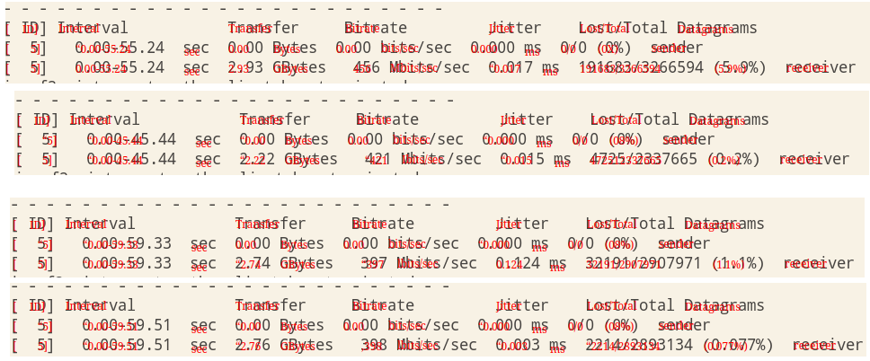

# ocr
a selectable/copyable OCR tool based on vue and flask


## front setup
```sh
npm install
```

### compile dist
```sh
npm run build
```

## server setup

1. tesseract is required to be installed in the os

```sh
sudo pacman -S tesseract-data-eng
```

2. install python packages
```sh
pip install pytesseract, flask, flask-cors
```

## run

```sh
python main.py
```

## detect Chinese text

1. install tesseract language package
```sh
pacman -S tesseract-data-chi_sim 
```

2. change calling parameter in request
```diff
def ocr():
    file = request.files['image']
    img = Image.open(file.stream)
-   data = pytesseract.image_to_data(img, output_type=pytesseract.Output.DICT)
+   data = pytesseract.image_to_data(img, lang='chi_sim', output_type=pytesseract.Output.DICT)
```

Chinese text detection is terrible by the way

## include css file in vue2
import globale css style in main.js, and place css file in src/assets
```js
import './assets/4color.css'
```

## watch of vue2 to update a css varable
methods and computed methods need to return value, but watch methods don't

```js
  watch: {
    hue_value (newValue) {
      document.documentElement.style.setProperty('--hue', newValue)
    }
  }
```

computed methods invoke when a dependency element changes


### 4color 
a very interesting idea 
https://www.iamsajid.com/colors/